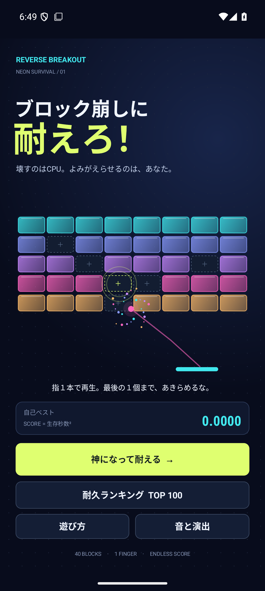
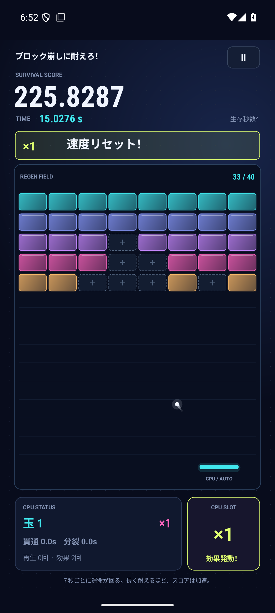
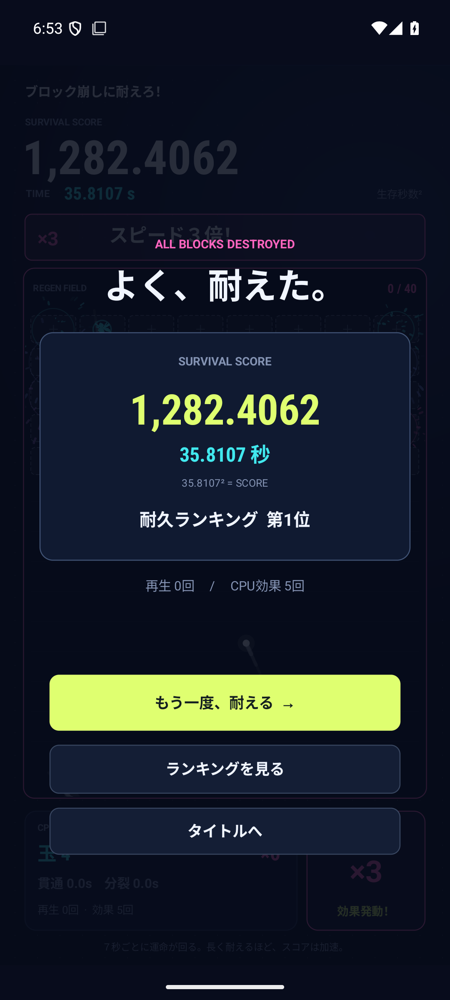
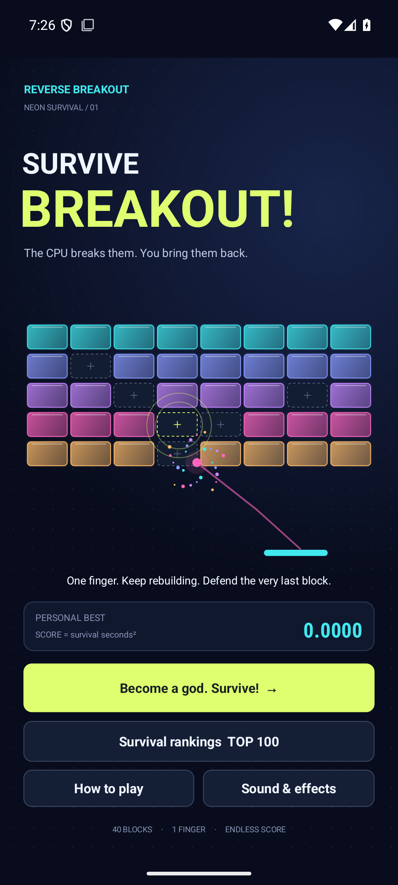
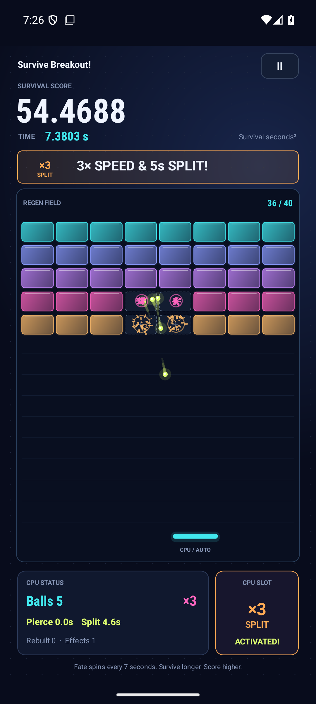
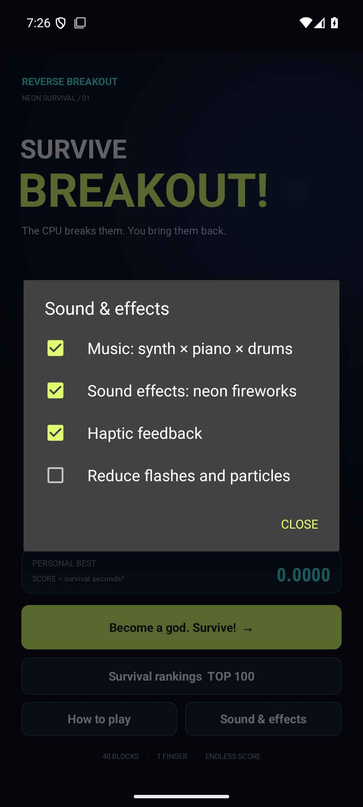

# ブロック崩しに耐えろ！

**壊すのはCPU。よみがえらせるのは、あなた。**

ブロックを再生する神になって、CPUのブロック崩しを妨害するAndroid向け耐久ゲーム。
玉が増え、速度が掛け算で膨らみ、ネオンの花火が弾ける中、最後の１個まで守りきろう。

<p>
  
  
  
</p>

## 日本語・英語の自動切り替え

端末の最優先言語が日本語なら日本語、それ以外なら英語で表示する。
英語名は **Survive Breakout!**。タイトル・プレイ画面・全９種類のスロット・警告・遊び方・設定・ランキング・読み上げ説明まで対応。
フランス語、日本語の順に登録されている端末も英語になる。Android 13以降で利用者がOS側のアプリ別言語を指定した場合は、その最優先言語に従う。
言語を変えても途中のゲーム・ランキング・音の設定は引き継ぐ。時間とスコアは両言語とも小数点以下４桁で表示する。

<p>
  
  
  
</p>

## 遊び方

- ブロックは横８×縦５の全40個。点線になった空きマスを、**１本の指でタップ**すると再生する。
- 指を離した時点で再生を確定。スワイプ・長押しによる連続再生はできない。
- ２本以上の指が同時に触れると、**「ズルはダメ！」**を３秒間表示。その間は再生できず、ゲームは進み続ける。
- 全40個が破壊された瞬間に終了。**スコア＝生存時間（秒）の２乗**。
- 生存時間は小数点以下４桁で表示。終了したゲームの上位100件を端末内に保存する。
- 途中のゲームは一時停止して保存可能。バックグラウンド中は時間・物理・スロット・効果時間を止め、再開時に３秒カウントダウンする。

## ７秒ごとのCPUスロット

右下の縦１列スロットが回転し、**７秒ごと**に確定。全９種類で、各目の確率は1/9。
当選時は画面上部に通知し、約1.15秒間出目を見せてから回転を再開する。次の確定までは合計７秒。

| 出目 | 効果 | 重複時 |
| --- | --- | --- |
| ＋３ | 玉を３つ追加 | 現在の玉数に加算 |
| ×２ | 玉の速度を２倍 | 現在の倍率に乗算 |
| ×３ | 玉の速度を３倍 | 現在の倍率に乗算 |
| 貫通 | ５秒間ブロックを貫通 | 残り時間に５秒加算 |
| 分裂 | ５秒間、衝突した１玉が２玉になる | 残り時間に５秒加算 |
| １玉 | 玉数を初期値の１つに戻す | 他の効果を維持 |
| ×１ | 玉の速度を初期値に戻す | 他の効果を維持 |
| ＋５ ＆ 貫通 | 玉を５つ追加し、全玉が５秒間ブロックを貫通 | 玉数を加算、貫通の残り時間に５秒加算 |
| ×３ ＆ 分裂 | 玉の速度を３倍にし、５秒間、衝突した１玉が２玉になる | 現在の速度に３を乗算、分裂の残り時間に５秒加算 |

複合の出目も１回の当選として数え、２つの効果を同時に適用する。右下スロットでは２段の記号で表示する。

速度・玉数にゲーム上の上限は設けていない。描画負荷を抑えるため、花火の粒子と同時発音数のみ制限する。
CPUの棒は壁での反射を含めて落下位置を予測し、有限の速度で左右に移動する。
同時に離れた位置へ落ちるなど、物理的に捕れない玉は落下。全て落ちた場合は0.65秒後に１玉を再発射する。

## 音と演出

- ブロックの色に連動するネオン粒子、爆発リング、玉の光跡、再生エフェクト。
- 破壊のたびに電子音SE。再生、スロット、警告、パドルにも専用SE。
- BGM「NEON REGEN FESTIVAL」：180 BPM、32小節、約42.667秒のオリジナルループ。
- F→G→Am→Amを軸に、オリジナルの旋律を電子音・合成ピアノ・ベース・ドラムで演奏する。
- 音源はすべてこのリポジトリの生成スクリプトで合成。外部の楽曲・録音・サンプル・MIDIは使用しない。
- BGM、SE、振動、控えめな光・粒子を設定可能。

## 開発・ビルド

Android 8.0以降（minSdk 26）。compileSdk / targetSdk 36、JDK 17、Kotlin 2.2.20、AGP 8.13.0。

```sh
# Android SDKの場所を指定する（例）
printf 'sdk.dir=/path/to/Android/Sdk\n' > local.properties

./gradlew testDebugUnitTest lintDebug lintRelease assembleDebug assembleRelease bundleRelease assembleDebugAndroidTest
```

直接インストールして試せる開発用APK：`app/build/outputs/apk/debug/app-debug.apk`。
release APK / AABは配布鍵を設定していないため**未署名**。Google Play向けの署名・ストア素材・公開は別工程。
`local.properties`、署名鍵、生成したAPK/AABはGit管理対象外。

```sh
# 操作検証は専用エミュレーターを指定する
adb -s emulator-5554 install -r app/build/outputs/apk/debug/app-debug.apk
adb -s emulator-5554 install -r app/build/outputs/apk/androidTest/debug/app-debug-androidTest.apk
adb -s emulator-5554 shell am instrument -w \
  io.github.hatake716.taero.test/androidx.test.runner.AndroidJUnitRunner
```

テストは対象アプリのエミュレーター内データを初期化する。日常利用端末では実行しないこと。

音源の再生成：Python 3 + NumPy + FFmpegで `python3 tools/generate_audio.py`。

## 構成

| ファイル | 役割 |
| --- | --- |
| `GameEngine.kt` | Androidに依存しない時間・物理・CPU・スロット・入力規則・スコア |
| `GameView.kt` | Canvas描画、タッチ入力、カウントダウン、画面、花火 |
| `GameStore.kt` | 上位100件と中断ゲーム、音・演出設定の保存 |
| `GameAudio.kt` | BGMループ、SE多重発音、オーディオフォーカス |
| `MainActivity.kt` | ライフサイクル、インセット、遊び方・ランキング・設定 |
| `tools/generate_audio.py` | オリジナル楽曲とSEの再現可能な生成 |

通信・広告・アカウント登録はない。記録は端末内に保存される。
詳細は [ゲーム仕様](docs/GAME_DESIGN.md)、[音源ノート](docs/AUDIO.md)、[検証記録](docs/VALIDATION.md) を参照。
